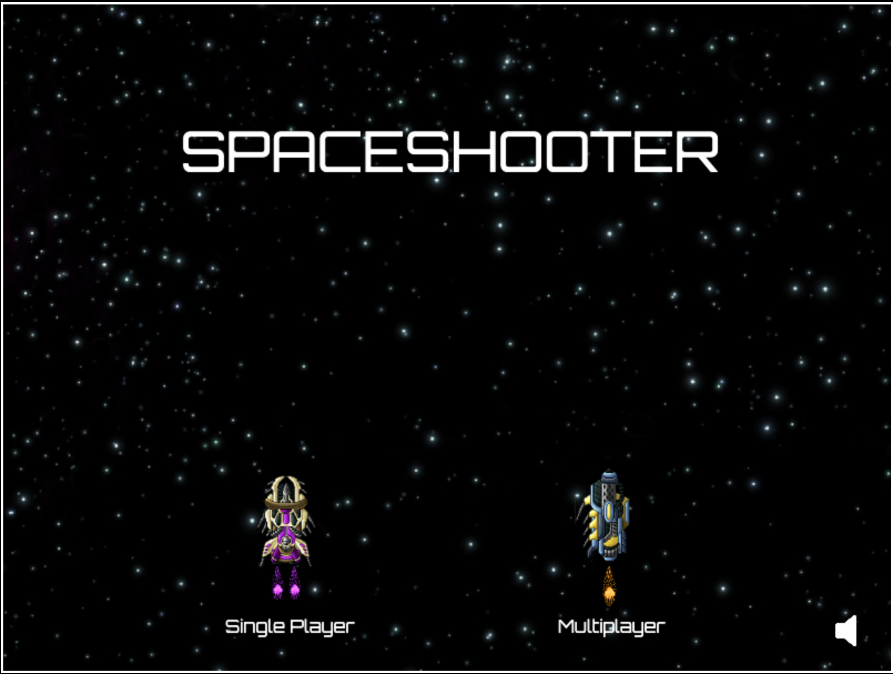

# Game Over



## About the project
This was our end of first year project. The assignment was to create a game or graphical experience using Javascript. We chose to build a Spaceshooter game with Phaser 3, Javascript framework.

## Authors
* <a href="https://github.com/Milliebase">Betsy Alva Soplin</a>
* <a href="https://github.com/Vpuke">Viktor Puke</a>

## Installation

1. To be able to play this game, clone this repository to your directory through the terminal.
```
$ git clone https://github.com/Vpuke/gameover.git
```

2. Change current directory to the cloned repo.
```
$ cd gameover
```

3. Install dependencies
```
$ npm install
```

4. Start local server, http://localhost:1234/
 ```
$ npm run dev
```

5. Happy Gaming


## Professional developer testers
* <a href="https://github.com/ViktorSjoblom">Viktor Sjöblom</a>
* <a href="https://github.com/jesperlndqvst">Jesper Lindqvist</a>
* <a href="https://github.com/AltDom">Dominic Kersch</a>
* <a href="https://github.com/oaflindberg">Andreas Lindberg</a>

## Regular not so professional testers
*
*
*
*

## Code Review
*
*
*
*
*
*
*
*
*
*

Carried out by: 
* <a href="https://github.com/mikaelaalu">Mikaela Lundsgård</a>
* <a href="https://github.com/alexandergustafssonflink">Alexander Gustafsson Flink</a>


## License
MIT 